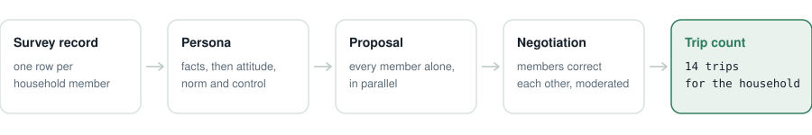
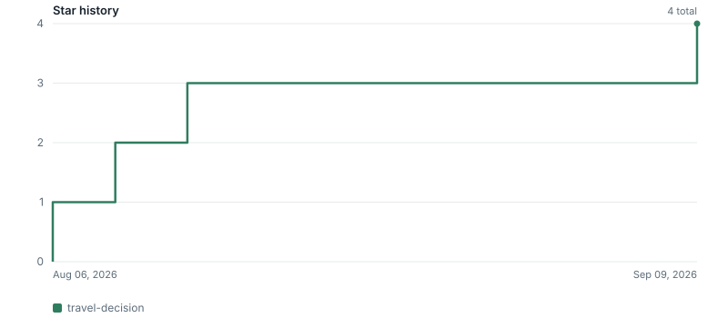

# 🚗 travel-decision

Household **trip planning and generation** simulated via persona-enriched multi-agent negotiation (**PEMAND**).

<p>
<a href="https://github.com/HDSim-AI/travel-decision"></a>
<a href="https://github.com/HDSim-AI/travel-decision"></a>
<a href="https://github.com/HDSim-AI/travel-decision/actions/workflows/ci.yml"></a>
<a href="https://github.com/HDSim-AI/travel-decision/blob/main/pyproject.toml"></a>
<a href="./LICENSE"></a>
<a href="https://arxiv.org/abs/2604.10475"></a>
<a href="https://yushundong.github.io/pemand_simulation/pemand_official_site.html"></a>
<!-- Uncomment once a tagged release with build artifacts exists. Until then shields renders "no releases found":
<a href="https://github.com/HDSim-AI/travel-decision/releases"></a>
-->
</p>

<!-- Uncomment both once the package is published to PyPI:
<a href="https://pypi.org/project/hdsim-travel/"></a>
<a href="https://pepy.tech/project/hdsim-travel"></a>
-->

**A domain package.** The method lives in [`hdsim`](https://github.com/HDSim-AI/hdsim), the core; this repository adds only the survey loaders and the configuration for one decision. [`residential-mobility`](https://github.com/HDSim-AI/residential-mobility) is the other.


## What this does

Predicts how many trips a household makes. It reads NHTS 2017 or Puget Sound 2023 survey rows and
returns a trip count for each household, with the conversation that produced it.

<picture>
  <source media="(prefers-color-scheme: dark)" srcset="./docs/pipeline-travel-dark.svg">
  
</picture>

Each member becomes an agent with attitudes, subjective norms and perceived behavioral control
taken from their own survey record. They propose independently, with no anchoring, then negotiate
in moderated rounds until the household settles on one number.

| You are trying to… | What you get |
|---|---|
| Forecast trip generation under a new price, fare, or transit line | A trip count for each household, from its own record |
| Build travel demand inputs without fielding a new survey | Counts for the households your survey already covers |
| Explain why a household's total is what it is | The negotiation transcript behind each number |

On NHTS 2017 this brings mean absolute error from 3.07 down to 2.38 against the strongest classical
baseline, and on Puget Sound 2023 from 2.75 to 1.99. Table 1,
[arXiv:2604.10475](https://arxiv.org/abs/2604.10475).

| You want to… | Go to |
|---|---|
| See it run, with nothing installed | [Live demo](https://yushundong.github.io/pemand_simulation/pemand_official_site.html) |
| Watch a household negotiate, with no API key | [Quick start](#quick-start) |
| Understand the method itself | [hdsim](https://github.com/HDSim-AI/hdsim) |
| Predict whether a household moves instead | [residential-mobility](https://github.com/HDSim-AI/residential-mobility) |
| Model a decision that is neither | [Adding a domain](https://github.com/HDSim-AI/hdsim#adding-a-domain) |

## Quick start

```bash
pip install -e .
hdsim demo                        # replay a recorded negotiation, no API key needed
```

Simulate the bundled household against a model:

```bash
cp ../hdsim/.env.example .env     # add HDSIM_API_KEY
python examples/run_travel.py
```

```python
from hdsim.travel import NHTS, build_personas, load_example, simulate

household = load_example()
build_personas(household, NHTS)
simulate(household, NHTS)
print(household.consensus_value)
```

Real data: `load_nhts("perpub.csv", min_members=2)`. NHTS 2017 is at
<https://nhts.ornl.gov/downloads>. No survey data ships with this package.

Requires [`hdsim`](https://github.com/HDSim-AI/hdsim), the method core.

## Contributing

Loaders for another travel survey, better fact translations, new scenarios and evaluations all
belong here; see [CONTRIBUTING.md](CONTRIBUTING.md). Changes to the method itself belong in
[`hdsim`](https://github.com/HDSim-AI/hdsim), and adding a whole new decision is
[one file](https://github.com/HDSim-AI/hdsim/blob/main/examples/minimal_domain.py).

## Citation

```bibtex
@article{sun2026pemand,
  title   = {PEMAND: Persona-Enriched Multi-Agent Negotiation for Household Decision-Making},
  author  = {Sun, Yuran and Sameen, Mustafa and Zhang, Yaotian and Gu, Rongguan and
             Vibhute, Mrunal and Wu, Chia-yu and Lei, Yuanyuan and Zhao, Xilei},
  journal = {arXiv preprint arXiv:2604.10475},
  year    = {2026}
}
```

## License

MIT

## Star history



<sub>Redrawn whenever someone stars the repository, by
<a href="./.github/workflows/star-history.yml">a workflow</a> reading our own stargazer data.
star-history.com and starchart.cc cannot chart this: GitHub restricted the stargazers timestamp
API on 2026-06-30 to a repository's own collaborators, and their workaround is to put an access
token in the chart URL.</sub>
