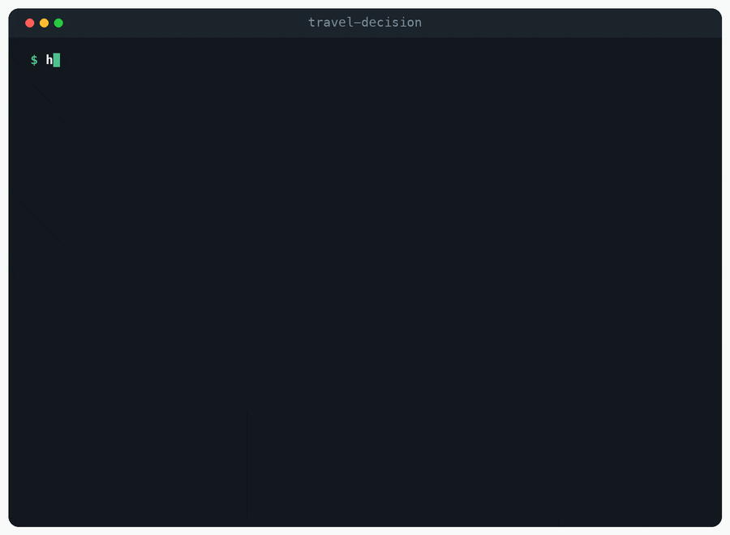

# 🚗 travel-decision

Household **trip planning and generation** simulated via persona-enriched multi-agent negotiation (**PEMAND**).

<p>
<a href="https://github.com/HDSim-AI/travel-decision"></a>
<a href="https://github.com/HDSim-AI/travel-decision/actions/workflows/ci.yml"></a>
<a href="https://github.com/HDSim-AI/travel-decision/blob/main/pyproject.toml"></a>
<a href="./LICENSE"></a>
<a href="https://arxiv.org/abs/2604.10475"></a>
<a href="https://yushundong.github.io/pemand_simulation/pemand_official_site.html"></a>
</p>

<!-- Uncomment both once the package is published to PyPI:
<a href="https://pypi.org/project/hdsim-travel/"></a>
<a href="https://pepy.tech/project/hdsim-travel"></a>
-->

Part of the [HDSim](https://github.com/HDSim-AI) ecosystem.



## 🧭 What can this do?

`hdsim.travel` predicts how many trips a household makes. It reads NHTS 2017 or Puget Sound 2023
survey rows and returns a trip count for each household, along with the conversation among the
household members that produced it.

| You are trying to… | What you get |
|---|---|
| Forecast trip generation under a new road price, fare, or transit line | Per-household trip counts under the scenario you describe |
| Build travel demand inputs without fielding a new survey | Counts for the households your survey already covers |
| Explain why a household's total is what it is | The negotiation transcript behind each number |
| Fill in a group your survey covers thinly | Counts for those households, from the records you do have |

On NHTS 2017 this brings mean absolute error from 3.07 down to 2.38 against the strongest classical
baseline, and on Puget Sound 2023 from 2.75 to 1.99. Table 1,
[arXiv:2604.10475](https://arxiv.org/abs/2604.10475).

| You want to… | Go to |
|---|---|
| Watch a household negotiate, with no API key | [Quick start](#quick-start) |
| Understand the method itself | [hdsim](https://github.com/HDSim-AI/hdsim) |
| Predict whether a household moves instead | [residential-mobility](https://github.com/HDSim-AI/residential-mobility) |
| Model a decision that is neither | [Adding a domain](https://github.com/HDSim-AI/hdsim#adding-a-domain) |

## How it works

```
survey record -> theory-grounded personas -> independent proposals -> moderated negotiation -> household trip count
```

Each household member becomes an agent with attitudes, subjective norms, and perceived
behavioral control derived from real survey data. Members propose independently, with no
anchoring. They then negotiate in structured rounds while a moderator checks every turn
for persona consistency and feasibility.

## Quick start

```bash
pip install -e .
hdsim demo                        # replay a recorded negotiation, no API key needed
```

Simulate the bundled household against a model:

```bash
cp ../hdsim/.env.example .env     # add HDSIM_API_KEY
python examples/run_travel.py
```

```python
from hdsim.travel import NHTS, build_personas, load_example, simulate

household = load_example()
build_personas(household, NHTS)
simulate(household, NHTS)
print(household.consensus_value)
```

Real data: `load_nhts("perpub.csv", min_members=2)`. NHTS 2017 is at
<https://nhts.ornl.gov/downloads>. No survey data ships with this package.

Requires [`hdsim`](https://github.com/HDSim-AI/hdsim), the method core.

## Contributing

Issues and pull requests are welcome, especially new scenarios, survey loaders, agent
skills, and evaluations. See the [organization page](https://github.com/HDSim-AI) for
the project scope.

## Citation

```bibtex
@article{sun2026pemand,
  title   = {PEMAND: Persona-Enriched Multi-Agent Negotiation for Household Decision-Making},
  author  = {Sun, Yuran and Sameen, Mustafa and Zhang, Yaotian and Gu, Rongguan and
             Vibhute, Mrunal and Wu, Chia-yu and Lei, Yuanyuan and Zhao, Xilei},
  journal = {arXiv preprint arXiv:2604.10475},
  year    = {2026}
}
```

## License

MIT
